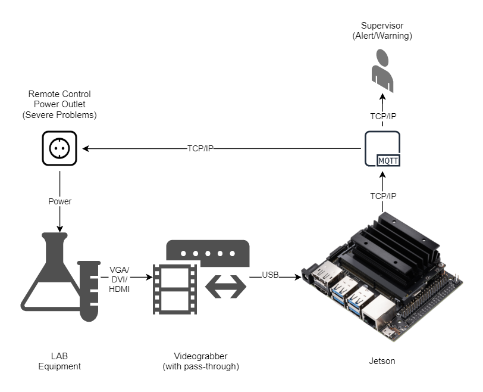
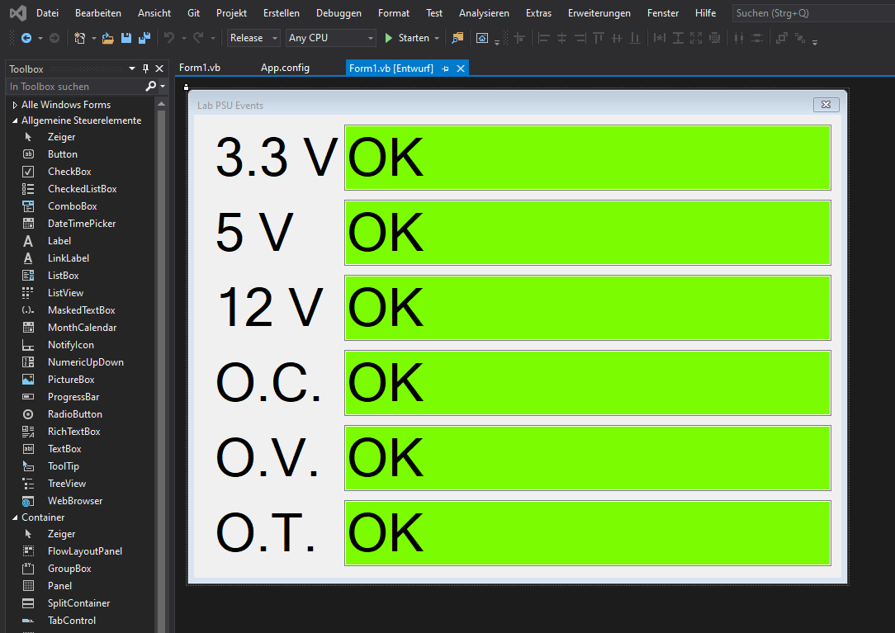
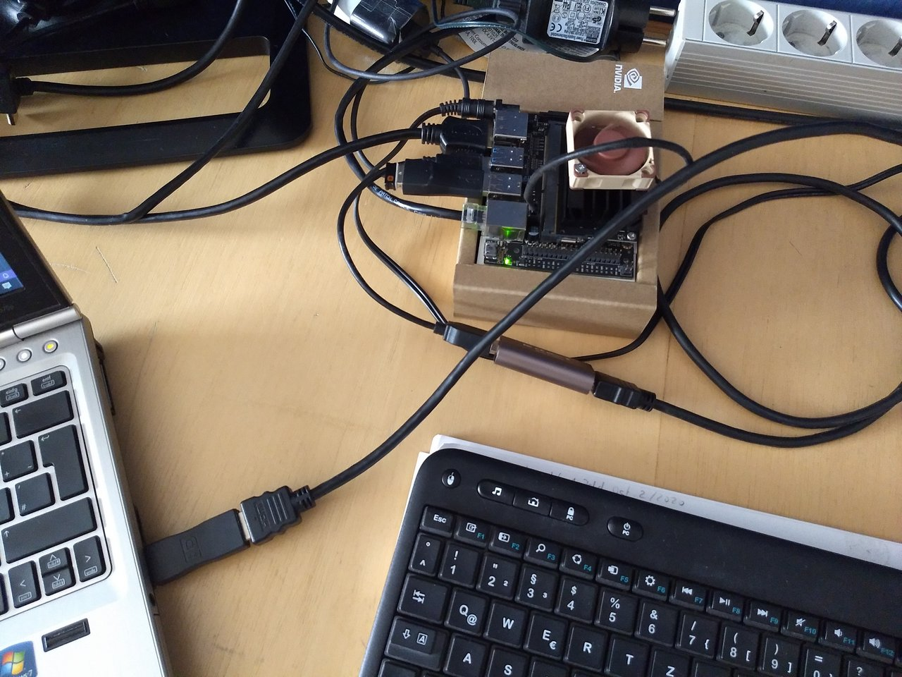
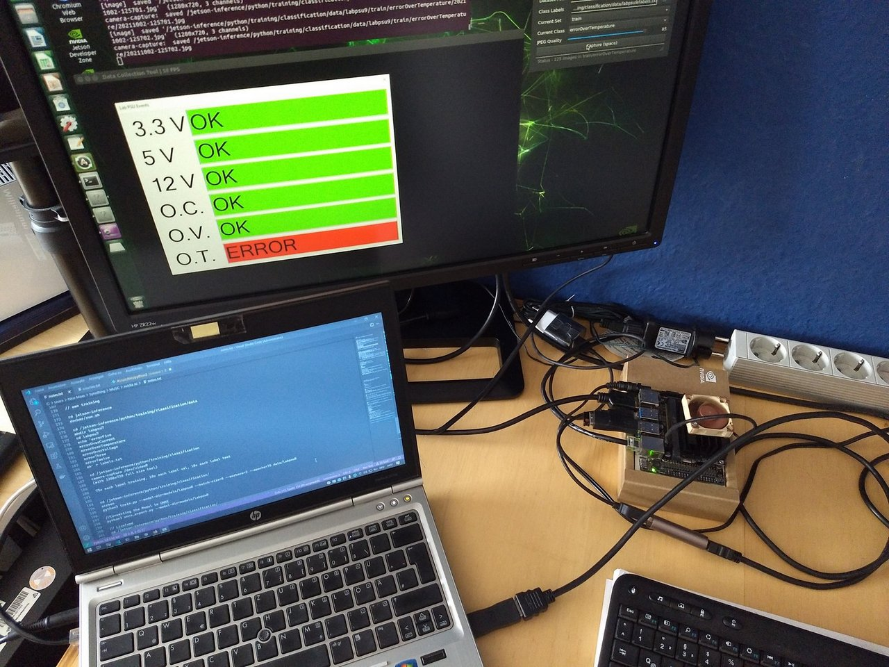
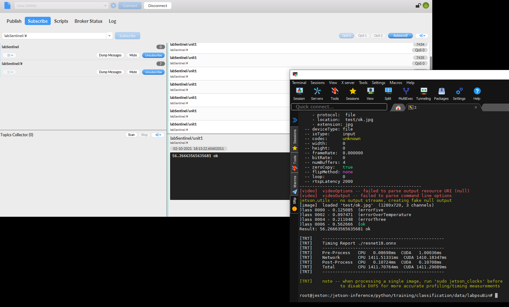
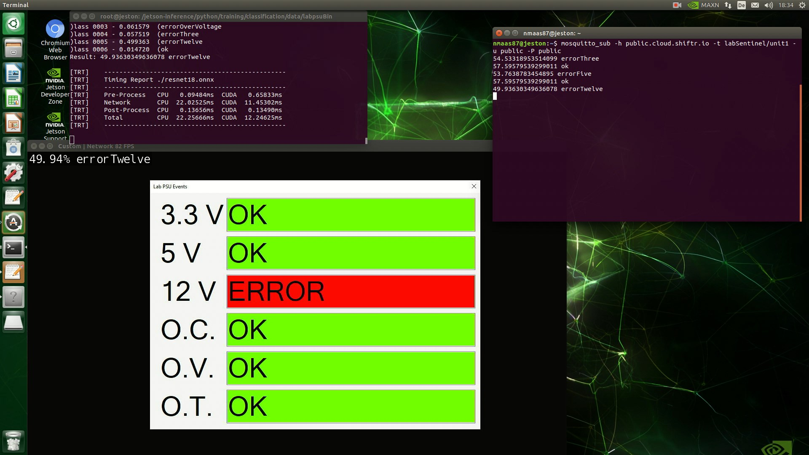

# labSentinel

## Setting the scene

Working in the Aerospace Industry - with additional roots in Material Sciences and Life Sciences comes with the perk of having to work in laboratories around quite expensive - and old - machinery. Most of this expensive lab equipment has been bought back in the '90s and is controlled by x86 computers running either Windows NT, Windows 95 or - in the most advanced cases - Windows XP. For most of these machines, no software updates are available (or support for modern OS) - and they have another problem: They cannot integrate into modern monitoring solutions - or any monitoring at all. These tools were made with human operators or technicians in mind who would monitor the equipment 24/7 - waiting for some virtual red led of big warning message to appear. Running a lab with dozens of such machines, which shall operate 24/7 with as little downtime as possible can be an expensive and mundane task, which this project tries to solve.

## The proposed solution

NVIDIA Jetson is the ideal and cost-effective solution for this problem: Attaching an HDMI Grabber including necessary adapters (e.g. for VGA or DVI outputs of the lab equipment) allows to train a classification model which can recognize "good" and "bad" states and then alert supervisor - or even turn off power supply to the equipment if something goes really wrong. The best use of such a solution is however in combination with a technician to lessen the workload and allow for more effective usage of human resources.

<p align="center">
  
</p>


## Proof of concept

Youtube Demo: https://youtu.be/PYgAdH4YiLw

### Needed hardware / software

- NVIDIA Jetson Nano 2 GB/4 GB with powersupply
- Videograbber
    - either one of the cheap "HDMI Video Capture" USB cards from china
    - or one of the better devices with pass-through for the monitor signal (e.g. Elgato and similar)
- Jetson Jetpack
- Jeton Inference


### LabDeviceControlSoftware / Demo GUI

No idea without a proof of concept, for this use-case I designed a small program called "LabDeviceControlSoftware". It was written in VB.Net (Visual Studio 2019) to have a more faithful recreation of the old softwares look and feel. The source code is included in the LabDeviceControlSoftware/ folder

<p align="center">
  
</p>

In this software, we have actually 7 different "states" we can picture our imaginary power supply to be in:
- ok: all is on "OK", the mode we want
- Errors:
    - errorFive: the 5 V rail shows an error
    - errorOverCurrent: overcurrent (output) error
    - errorOverTemperature: overtemperature error
    - errorOverVoltage: overvoltage (input) error
    - errorThree: the 3.3 V rail shows an error
    - errorTwelve: the 12 V rail shows an error

To allow for easier training, the software includes multiple key bindings to switch the modes:
- You can click the textlabels to switch "OK" to "Error" and back
- The number keys 1-6 are also bound to the same functionality
- The "r" key moves the window on your desktop to a new position, this is very useful for training

### Training
As starting point I flashed the NVIDIA Jetson Nano with the latest OS and setup the NVIDIA Inference Docker Container ( https://github.com/dusty-nv/jetson-inference/blob/master/docs/aux-docker.md ). I connected my Windows 10 Laptop with my Demo GUI via the videograbber with the Jetson ...


<p align="center">
  
</p>


... and launched the container. 
Inside this I created a new project, including then needed labels for the classification:

````
cd /jetson-inference/python/training/classification/data
mkdir labpsu
cd labpsu
echo 'errorFive
errorOverCurrent
errorOverTemperature
errorOverVoltage
errorThree
errorTwelve
ok' > labels.txt
````

After that, I could start the camera-capture tool and started taking screenshots, according to the labels.

````
cd /jetson-inference/python/training/classification
camera-capture /dev/video0
````

<p align="center">
  
</p>

All pictures were captured at 1280*720, while moving the GUI position on the screen after each shot with the "r" key. I took 75 pictures for training and 5 additional unique ones for test. At random, I choose 10 training pictures and added them to the val(idation) folder of each class.

After I had enough datapoints, I trained the model for 75 epochs to get a good understanding of what is going on ...

````
cd /jetson-inference/python/training/classification
python3 train.py --model-dir=models/labpsu --batch-size=8 --workers=2 --epochs=75 data/labpsu
````

... and converted the model to ONNX, for useage with imagenet:

````
cd /jetson-inference/python/training/classification
python3 onnx_export.py --model-dir=models/labpsu
````

### Validation

The resulting model could then be tested with a live video feed, again

````
cd /jetson-inference/python/training/classification/
imagenet --model=models/labpsu/resnet18.onnx --input_blob=input_0 --output_blob=output_0 --labels=data/labpsu/labels.txt /dev/video0
````

### Data
You can find all training data in the labpsu/ folder


## Pre-packed Demo
If you quickly want to demo this concept, there is the labpsuBin/ folder, which contains the model, the labels, a modified version of imagenet.py and some test pictures.

### Usage
Please copy the labpsuBin/ folder into your jeston-inference container and run the setup:

````
pip3 install paho-mqtt
````

Afterwards you can run the demo (run.sh) which will just check some example pictures in headless mode and output the results to the screen as well to the MQTT Broker https://www.shiftr.io/ ( public.cloud.shiftr.io on port 1883, user: public, password: public) into the thread "labSentinel/unit1"

````
chmod +x run.sh
./run.sh
````

<p align="center">
  
</p>

Alternatively, you can live demo the system by just running, if you have the same setup.
````
python3 imagenetplus.py --headless /dev/video0
````

<p align="center">
  
</p>

## Conclusion
This project showcased the overall feasibility of automated supervision of old lab equipment using NVIDIA Jetson and its AI capabilities
